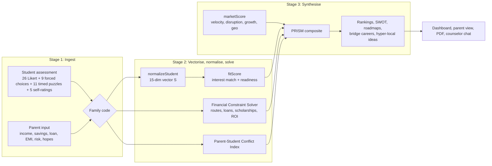

# PRISM Engine

Multi-dimensional STEAM career guidance for Indian students **and their parents**.
DataQuest 3.0, problem statement DQNM. Built with Flutter (Android + Web).

Every score is computed by deterministic, explainable math. The AI counselor only explains
results; it never changes a number. Tap any score in the app to see its formula and inputs.

## Download the Android app

**[Download the latest APK](https://github.com/YOUR-USERNAME/prism-engine/releases/latest)** (file: `PRISM-Engine-v1.0.apk`)

To install on an Android phone:
1. Open the link on the phone and download the APK.
2. Tap the downloaded file. If Android asks, allow installs from this source (your browser or Files app).
3. Tap **Install**, then open **PRISM Engine**.

The APK is signed with Flutter's default debug key, which is fine for sharing and testing but not for the Play Store.
All salary, fee and demand figures in the app are illustrative demo data.

To build the APK yourself:

```bash
flutter build apk --release
# output: build/app/outputs/flutter-apk/app-release.apk
```

Release builds need `<uses-permission android:name="android.permission.INTERNET"/>` in
`android/app/src/main/AndroidManifest.xml` (for fonts and the optional AI counselor).

## Run it

```bash
# 1. Generate the Android/Web platform folders (keeps lib/, assets/, test/ untouched)
flutter create --project-name prism_engine --platforms=android,web .

# 2. Get packages and run the tests
flutter pub get
flutter test

# 3. Run
flutter run -d chrome          # web
flutter run                    # Android phone/emulator
```

Optional AI counselor (without a key, the offline rule-based counselor is used):

```bash
flutter run -d chrome --dart-define=LLM_PROVIDER=anthropic --dart-define=LLM_KEY=your_key
flutter run -d chrome --dart-define=LLM_PROVIDER=gemini    --dart-define=LLM_KEY=your_key
# optional: --dart-define=LLM_MODEL=<model id>
```

Never commit the key. In production, put the LLM call behind your own backend.

For a release APK, make sure `android/app/src/main/AndroidManifest.xml` has
`<uses-permission android:name="android.permission.INTERNET"/>` (fonts and the AI counselor need it).

Deploy the web build so judges can open a link:

```bash
flutter build web --release
# then upload build/web to Firebase Hosting, Netlify, or GitHub Pages
```

## Architecture



```
lib/
  models/models.dart         all data types
  engine/                    pure Dart, no Flutter, fully unit-tested
    normalize.dart           Stage 2.1  student vector
    fit.dart                 Stage 2.2  fit + gap analysis
    finance.dart             Stage 2.3  Financial Constraint Solver
    scholarships.dart        rule-based scholarship matching
    conflict.dart            Stage 2.4  PSCI + bridge careers
    market.dart              Stage 3.5  market score
    engine.dart              Stage 3.6  PRISM composite, runs the whole pipeline
    swot.dart, roadmap.dart, hyperlocal.dart   Stage 3.7-3.9
  data/                      seed loading, simulated school cohort
  services/                  LLM counselor, PDF report, job-feed adapter
  screens/, widgets/         UI
assets/data/                 seed JSON (ILLUSTRATIVE values)
tools/                       Python generators for the seed data + engine reference
test/engine/                 unit tests
```

## Formulas

| Step | Formula |
|---|---|
| Student vector | Likert `(v-1)/4` (reversed items flipped); aptitude `0.7 × accuracy + 0.3 × self-rating`; missing → 0.5 |
| Fit | `0.65 × max(0, interest match) + 0.35 × (1 − ability shortfall)`; interest match = weighted Pearson over the 6 RIASEC types, shortfall over aptitude and work style |
| Total cost | `(tuition + living) × years + coaching + exam fees` |
| Loan capacity | `min(limit for comfort level, PV of EMI over 84 months @ 9%)`, EMI = `min(parent max EMI, 35% of starting monthly salary)` |
| Scholarship | `50% × min(top-2 matched schemes × years, tuition)` |
| Feasibility | `F = min(1, (savings + scholarship + loan) / cost)`; viable if `F ≥ 0.6`; wrong stream → `F × 0.3` |
| ROI | `(NPV 10-yr salary − NPV baseline earnings − cost) / cost`, discount 8%; normalised `(min(ROI,6)+1)/(min(ROI,6)+4)` (very cheap courses can't dominate) |
| PSCI | `100 × [0.35(1 − overlap) + 0.25·risk gap + 0.20·salary gap + 0.20·relocation/timeline]` |
| Market | `0.35·job-growth rank + 0.25·(1 − disruption) + 0.20·salary growth + 0.20·geo demand` |
| PRISM | `100 × (α·Fit + β·M + γ·F + δ·ROI) / (α+β+γ+δ) − λ·PSCI/100·(1 − parent alignment)` |

Defaults: α 0.45, β 0.20, γ 0.15, δ 0.20, λ 10 (adjustable live in the app).

## Demo script (3 minutes)

1. **Landing page**: point at the prism. "One student goes in; five transparent scores come out."
2. Tap **Priya, Class 12, Madurai**. She loves maths and art; her parents want medicine; income about Rs. 3 L.
3. **Conflict panel**: PSCI is about 60, "significant". Show the two plain-language drivers.
4. Show **bridge careers**: biomedical engineer appears, a career that fits Priya and sits close to her parents' wish for medicine.
5. Tap **product designer**: fit is high, but NID-level fees stretch the budget. Show the route table and matched scholarships.
6. Open **Try different weights**: drag the family penalty to 0 and fit to 1, and watch design careers rise. Toggle the **live job market**.
7. Tap any **info icon** to show the exact formula and inputs.
8. Open **Parent summary** (plain language and a discussion guide), then **Download report**.
9. Load **Arjun, Coimbatore**: the hyper-local panel suggests a solar pump controller from the city's pump industry.
10. Close on **How it works** and **School dashboard**.

## Data honesty

All salary, cost, demand, and growth figures are **illustrative demo values** generated by
`tools/generate_seed.py`. They are not official statistics. Exam months and scholarship rules are
simplified; the app tells users to verify on official websites. The Data Sources page lists where
production data would come from (PLFS, NASSCOM, job-portal indices, WEF Future of Jobs, AISHE/NIRF, NSP).

To change data: edit the tables in `tools/generate_seed.py` or `tools/generate_questions.py`, then run them.
`tools/engine_reference.py` re-implements the core scoring in Python, which is handy for tuning.

## Site map

**Marketing site** (spectrum curtain transition between pages):

| Route | Page |
|---|---|
| `/` | Home: a scroll story that teases each topic and links out |
| `/how-it-works` | The 3-stage method, plus a live weights demo |
| `/careers` | Career explorer with search and field filters |
| `/careers/:id` | One career: salary path, routes and costs, exams, demand map |
| `/parents` | Affordability, family alignment and privacy, shown with a demo family's real results |
| `/schools` | What the school dashboard shows |
| `/about` | Every formula, plus data sources (old `/methodology` and `/data-sources` redirect here) |

**App** (fade-and-rise transition): `/student`, `/parent`, `/results`, `/parent-view`, `/counselor`, `/admin`.

## Interaction kit

`lib/widgets/interactions.dart`, all reduced-motion aware and safe on touch screens:

- `MagneticButton`: pulls toward the mouse, springs back.
- `HoverLink`: underline draws in on hover or keyboard focus; arrow nudges right.
- `MaskedTextReveal`: a heading's real wrapped lines slide up from behind a clip.
- `ScrollFillText`: words fill with colour as the paragraph scrolls past.
- `PinnedScrollSection`: holds content on screen while the page scrolls, with 0..1 progress.
- `Marquee`: endless horizontal ticker that slows on hover.
- `CursorFollower` / `CursorTarget`: dot and ring cursor on desktop web; the ring shows a word over targets.
- `curtainPage`: the page transition used by go_router.

`lib/widgets/site_shell.dart` holds the global shell: first-load preloader (0% to 100%), header that hides on
scroll down and returns on scroll up, full-screen menu (Esc closes, focus stays inside), shared footer with the
oversized wordmark, and `prismAppBar` used by every app page.

## Logo and icons

The PRISM logo is the five score colours as stripes. `tools/build_icons.py` draws it and writes the browser
favicon (`web/favicon.png`), the install icons (`web/icons/`) and the Android launcher icons
(`android/app/src/main/res/mipmap-*/ic_launcher.png`).

## UI and 3D

The interface uses a dark "light through glass" design: deep navy background, glass panels, and the five
score colours (fit, market, affordability, return, family gap) as the only accents, always with the same meaning.
Headings and numbers use Space Grotesk; body text uses Manrope. The app opens in light mode; dark mode is one tap away in the header or menu.

**3D without extra packages.** All 3D is written in plain Dart (`lib/widgets/three_d.dart`): a small vector
class, yaw/pitch rotation, and a perspective camera, drawn with `CustomPainter`. It runs the same on web and Android.

- **Prism hero** (`Prism3DHero` in `lib/widgets/charts.dart`): a real triangular prism mesh, faces sorted back to
  front and flat-shaded, slowly spinning. A white beam enters and splits into five coloured beams that stay
  attached to the prism as it turns. Drag to rotate; on web it follows the mouse slightly.
- **Career constellation** (`lib/widgets/career_constellation.dart`): every career is a sphere placed by its real
  scores (across = fit, up = job demand, depth = affordability). Bigger spheres have higher PRISM scores; colour
  is the career's strongest score. Drag to orbit, scroll or pinch to zoom, double-tap to reset, tap a sphere to
  open that career. When the What-if sliders change, spheres glide to their new positions.

**Web hero (glass prism with real refraction).** On web, the landing page shows `web/hero/index.html`: a three.js
scene where a glass triangular prism refracts the headline "Choose Your Future" with six-band chromatic
dispersion (two render passes: back faces, then front faces). Drag to rotate; arrow keys turn it a third of a
turn. three.js r169 and the Space Grotesk font are bundled in `web/hero/`, so it works offline. If WebGL is not
available it shows the headline as plain text. On Android the landing page uses the pure-Dart `Prism3DHero`
instead; `lib/widgets/hero_scene.dart` picks the right one with a conditional import.

**Other UI pieces** (`lib/widgets/motion.dart`): tilt cards on desktop, counting score numbers, skeleton loaders,
scroll reveals. Wide screens get a section rail on the results page. The parent form is three short steps.

**Accessibility and performance.** All motion stops when the OS "reduce motion" setting is on. Animated 3D
canvases sit inside `RepaintBoundary`, and their tickers pause automatically when another page covers them.
The scoring engine is untouched by the UI layer, so all engine tests still apply.

## Future scope

- Real job-postings feed behind the `JobMarketSource` interface
- Backend (e.g. Supabase or Firebase) so student and parent can use different phones
- Validated psychometric instrument and norms for Indian students
- Full Tamil/Hindi content, voice summaries for parents
- Counselor accounts and anonymised school-level reports
